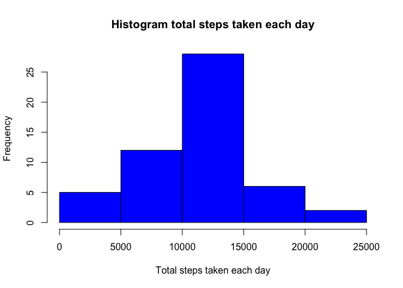
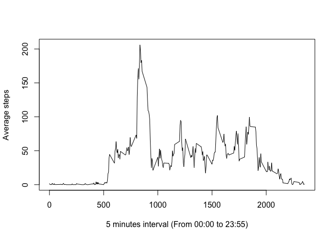
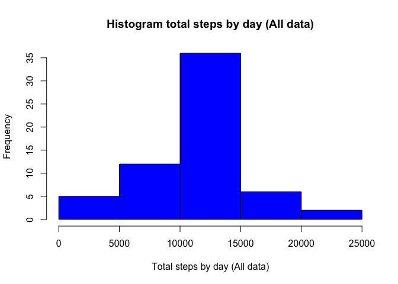
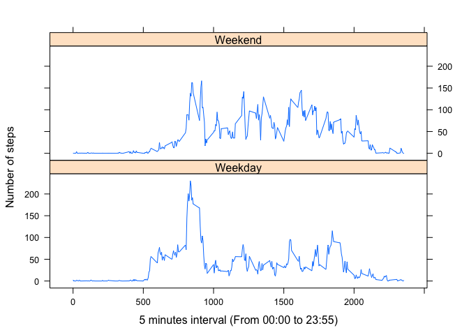

# Reproducible Research: Peer Assessment 1, by Rene Incer


## 1. Code for reading in the dataset and/or processing the data
#### Loading libray for plotting

```r
    library(lattice)
```

#### Loading and preprocessing the data

```r
    #unzipping activity
    activity <- unzip("activity.zip")
    #rading csv
    data <- read.csv(activity)
    #splitting data in Clean an NA
    dataClean <- data[!is.na(data$steps),]
    dataNA <- data[is.na(data$steps),]
```

## 2. Histogram of the total number of steps taken each day
#### Histogram

```r
    #group by date and aggregate sum of steps
    groupedData <- aggregate(steps ~ date, dataClean, sum)

    #plot histogram, frecuency of steps
    hist(groupedData$steps,
         xlab="Total steps taken each day",
         main="Histogram total steps taken each day",
         col="blue")
```

<!-- -->

## 3. What is mean total number of steps taken per day?
#### The Mean is: 

```r
    mean(groupedData$steps)
```

```
## [1] 10766.19
```
#### The Median is: 

```r
    median(groupedData$steps)
```

```
## [1] 10765
```

## 4. Time series plot of the average number of steps taken


```r
    #group by interval, mean of steps
    groupedData <- aggregate(steps ~ interval, dataClean, mean)
    
    #plotting time series interval steps
    plot(x=groupedData$interval, 
         y=groupedData$steps, 
         type="l", 
         xlab="5 minutes interval (From 00:00 to 23:55)", 
         ylab="Average steps")
```

<!-- -->

## 5. The 5-minute interval that, on average, contains the maximum number of steps

```r
    #max steps
    max(groupedData$steps)
```

```
## [1] 206.1698
```

```r
    #index of max steps
    indexMax <- which.max(groupedData$steps)
    #row data 
    groupedData[indexMax,]
```

```
##     interval    steps
## 104      835 206.1698
```


## 6. Imputing missing values
#### Count of NA rows 

```r
    # dataNA row count 
    nrow(dataNA)
```

```
## [1] 2304
```

#### A strategy for filling in all of the missing values in the dataset
I used mean interval values. I merged my previous calculated mean and merged with NA rows

```r
    #merging by interval
    dataNA <- merge(dataNA,groupedData,by.x="interval",by.y="interval",all=TRUE)
```

#### New dataset

```r
    #binding sames columns of original data
    dataNA <- cbind.data.frame(dataNA$steps.y, dataNA$date, dataNA$interval)
    #asigning same names of original
    colnames(dataNA) = colnames(data)
    #create new set with my previous dataClean and my NA data with mean
    newDataset = rbind(dataClean, dataNA)
```

## 7. Histogram of the total number of steps taken each day after missing values are imputed
#### Plot

```r
    #group by date, same part 2
    groupedData <- aggregate(steps ~ date, newDataset, sum)

    #plot histogram, frecuency steps, same part 2
    hist(groupedData$steps,
         xlab="Total steps by day (All data)",
         main="Histogram total steps by day (All data)",
         col="blue")
```

<!-- -->

#### Mean and Median

The Mean is: 

```r
    mean(groupedData$steps)
```

```
## [1] 10766.19
```
The Median is: 

```r
    median(groupedData$steps)
```

```
## [1] 10766.19
```


#### Are there differences in activity patterns between weekdays and weekends?

Mean, reminds the same, this is because I'm using mean to fill NA

Median increase by one

There is a minimal difference, and it does'nt impact results.

## 8. Panel plot comparing the average number of steps taken per 5-minute interval across weekdays and weekends


```r
    #new column with day of the week
    newDataset['day'] <- weekdays(as.Date(newDataset$date))
    #new column with type of the day using simple ifelse
    newDataset['dayType'] <- ifelse(newDataset$day == 'Saturday' | newDataset$day == 'Sunday', 'Weekend', 'Weekday')
    #group my data by interval and daytype
    groupedData <- aggregate(steps ~ interval + dayType, newDataset, mean)
    
    #plotting steps intervals splitting by daytype
    xyplot(steps ~ interval | dayType, groupedData, type = "l", 
           layout = c(1, 2), xlab = "5 minutes interval (From 00:00 to 23:55)", ylab = "Number of steps")
```

<!-- -->

This person walks more on weekdays, between 8 and 9 am. Maybe because people walks to work.

But on weekend people walk more beteen 10:00 and 16:00 maybe because they are enjoying their free day


